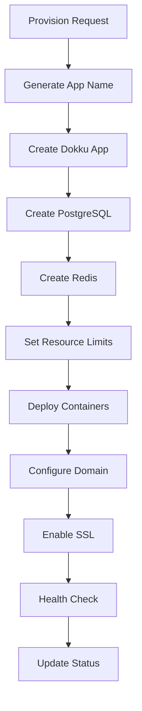
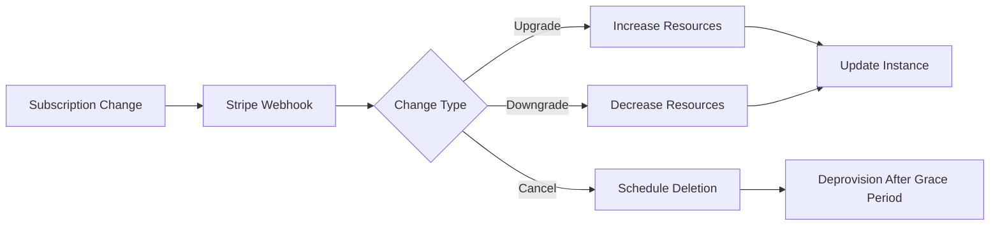

# MindRoom SaaS Platform - Master Implementation Plan

## Executive Summary

Transform MindRoom from a single-user self-hosted AI agent platform into a multi-tenant SaaS product where customers can subscribe, get their own isolated MindRoom instance, and access their AI agents across all communication platforms.

**Timeline**: 1-2 weeks with parallel development
**Approach**: 6 parallel AI agents building independent microservices
**Stack**: Dokku + Stripe + Supabase + Docker

## Business Model

### Subscription Tiers

| Tier | Price | Agents | Messages/Day | Storage | Support |
|------|-------|--------|--------------|---------|---------|
| **Free** | $0 | 1 | 100 | 1GB | Community |
| **Starter** | $49/mo | 3 | 1,000 | 10GB | Email |
| **Professional** | $199/mo | 10 | 10,000 | 100GB | Priority |
| **Enterprise** | Custom | Unlimited | Unlimited | Unlimited | Dedicated |

### Value Proposition
- **One AI, Everywhere**: Agents work across Slack, Discord, Telegram, WhatsApp via Matrix bridges
- **Persistent Memory**: Agents remember context across all platforms
- **Team Collaboration**: Multiple agents working together
- **Complete Isolation**: Each customer gets dedicated infrastructure
- **Self-Service**: Customers manage everything through portal

## Technical Architecture

### High-Level Architecture

```
┌─────────────────────────────────────────────────────────────────┐
│                         Customer Layer                          │
├─────────────────┬───────────────────────┬──────────────────────┤
│  Customer Portal │  MindRoom Instances   │  Communication      │
│   (Next.js)      │  (Isolated Docker)    │  Platforms          │
│                  │                       │  (Slack, Discord,   │
│                  │  ┌─────────────────┐  │   Telegram, etc)    │
│                  │  │ Customer 1      │  │                     │
│                  │  │ - Frontend      │  │                     │
│                  │  │ - Backend       │◄─┼────── Matrix        │
│                  │  │ - Agents        │  │       Bridges       │
│                  │  │ - Memory DB     │  │                     │
│                  │  └─────────────────┘  │                     │
│                  │                       │                     │
│                  │  ┌─────────────────┐  │                     │
│                  │  │ Customer 2      │  │                     │
│                  │  │ - Frontend      │  │                     │
│                  │  │ - Backend       │◄─┼────── Matrix        │
│                  │  │ - Agents        │  │       Bridges       │
│                  │  │ - Memory DB     │  │                     │
│                  │  └─────────────────┘  │                     │
└──────────┬───────┴───────────────────────┴──────────────────────┘
           │
┌──────────▼───────────────────────────────────────────────────────┐
│                         Platform Layer                           │
├─────────────────┬─────────────────┬─────────────────────────────┤
│   Stripe        │    Supabase     │    Dokku Provisioner       │
│   Webhooks      │   (Auth + DB)   │    (FastAPI Python)        │
│   Handler       │                 │                             │
│  (Node.js)      │  - User Auth    │  - Creates instances       │
│                 │  - Subscriptions │  - Manages resources       │
│  - Payment      │  - Instance DB   │  - Health monitoring       │
│  - Billing      │  - Usage Metrics │  - Scaling                │
└─────────────────┴─────────────────┴─────────────────────────────┘
           │
┌──────────▼───────────────────────────────────────────────────────┐
│                     Infrastructure Layer                         │
├─────────────────┬─────────────────┬─────────────────────────────┤
│     Dokku       │     Traefik     │      Monitoring            │
│   (Container    │   (Routing &    │   (Logs, Metrics,          │
│  Orchestration) │      SSL)       │     Alerts)                │
└─────────────────┴─────────────────┴─────────────────────────────┘
```

### Service Components

1. **Customer Portal** (`apps/customer-portal/`)
   - Next.js 14 with App Router
   - Supabase Auth integration
   - Stripe Customer Portal
   - Real-time instance status
   - Usage dashboards

2. **Admin Dashboard** (`apps/admin-dashboard/`)
   - React Admin framework
   - Full platform oversight
   - Customer management
   - Manual interventions
   - Platform metrics

3. **Stripe Handler** (`services/stripe-handler/`)
   - Webhook processing
   - Subscription lifecycle
   - Usage-based billing
   - Payment failure handling

4. **Dokku Provisioner** (`services/dokku-provisioner/`)
   - Instance creation/deletion
   - Resource management
   - Health monitoring
   - Configuration updates

5. **Supabase Backend** (`supabase/`)
   - Authentication
   - Database (PostgreSQL)
   - Real-time subscriptions
   - Edge Functions

6. **MindRoom Instances** (per customer)
   - Isolated Docker containers
   - Dedicated PostgreSQL
   - Agent configuration
   - Memory persistence

## Implementation Strategy

### Phase 1: Parallel Development (Week 1)

**6 AI Agents Working Simultaneously:**

| Agent | Directory | Deliverables |
|-------|-----------|--------------|
| **Agent 1: Supabase** | `supabase/` | Database schema, auth, Edge Functions |
| **Agent 2: Stripe** | `services/stripe-handler/` | Payment webhook handler |
| **Agent 3: Dokku** | `services/dokku-provisioner/` | Instance provisioning service |
| **Agent 4: Portal** | `apps/customer-portal/` | Customer self-service UI |
| **Agent 5: Admin** | `apps/admin-dashboard/` | Internal operations dashboard |
| **Agent 6: Orchestration** | Root level | Docker Compose, scripts, CI/CD |

**Why This Works:**
- Zero file conflicts between agents
- Each service is independent
- Clear API contracts
- Parallel development
- Independent testing

### Phase 2: Integration & Testing (Days 8-10)

1. **Local Integration Testing**
   - Run all services locally
   - Test complete flow: signup → payment → provisioning → access
   - Verify inter-service communication

2. **Production Deployment**
   - Deploy to staging environment
   - SSL certificates setup
   - Domain configuration
   - Monitoring setup

3. **End-to-End Testing**
   - Customer journey testing
   - Load testing
   - Security audit
   - Backup/restore verification

### Phase 3: Launch Preparation (Days 11-14)

1. **Documentation**
   - Customer documentation
   - API documentation
   - Operations runbook
   - Disaster recovery plan

2. **Monitoring & Alerts**
   - Service health dashboards
   - Payment failure alerts
   - Resource usage alerts
   - Customer success metrics

3. **Support Preparation**
   - Support ticket system
   - FAQ documentation
   - Troubleshooting guides
   - Escalation procedures

## Operational Workflows

### Customer Onboarding Flow

```mermaid
graph LR
    A[Customer Signs Up] --> B[Email Verification]
    B --> C[Choose Plan]
    C --> D[Stripe Checkout]
    D --> E[Payment Success]
    E --> F[Webhook Received]
    F --> G[Create Supabase Record]
    G --> H[Provision Instance]
    H --> I[Configure Agents]
    I --> J[Send Welcome Email]
    J --> K[Customer Accesses Portal]
```



### Instance Provisioning Process



### Subscription Management



## Security & Compliance

### Security Measures

1. **Infrastructure Security**
   - Complete tenant isolation
   - Network segmentation
   - Encrypted data at rest
   - TLS everywhere

2. **Application Security**
   - JWT authentication
   - API rate limiting
   - Input validation
   - SQL injection prevention

3. **Operational Security**
   - Audit logging
   - Access controls
   - Secret management
   - Regular updates

### Compliance Considerations

- **GDPR Ready**: Data portability, right to deletion
- **SOC 2 Path**: Security controls documented
- **HIPAA Possible**: Isolated infrastructure supports compliance
- **PCI DSS**: Stripe handles payment card data

## Cost Structure

### Infrastructure Costs (Monthly)

| Component | Specification | Cost |
|-----------|--------------|------|
| **Dokku Server** | 8 vCPU, 32GB RAM | $200 |
| **Supabase** | Pro plan | $25 |
| **Domain & SSL** | Wildcard cert | $20 |
| **Backup Storage** | 500GB S3 | $15 |
| **Monitoring** | DataDog/Similar | $50 |
| **Total** | | ~$310 |

### Unit Economics (Per Customer)

| Tier | Revenue | Infra Cost | Gross Margin |
|------|---------|------------|--------------|
| Free | $0 | $2 | -$2 |
| Starter | $49 | $5 | $44 (90%) |
| Professional | $199 | $15 | $184 (92%) |
| Enterprise | $999+ | $50+ | $949+ (95%) |

## Success Metrics

### Technical KPIs
- Instance provisioning time < 60 seconds
- Uptime > 99.9%
- API response time < 200ms
- Zero security incidents

### Business KPIs
- Customer acquisition cost < $100
- Monthly churn rate < 5%
- LTV:CAC ratio > 3:1
- Gross margin > 85%

### Customer Success KPIs
- Time to first value < 5 minutes
- Support ticket resolution < 24 hours
- NPS score > 50
- Feature adoption rate > 60%

## Risk Mitigation

### Technical Risks

| Risk | Mitigation |
|------|------------|
| Dokku scalability limits | Migration path to Kubernetes ready |
| Single point of failure | Multi-region deployment plan |
| Data loss | Automated backups every 6 hours |
| Security breach | Isolation + monitoring + rapid response |

### Business Risks

| Risk | Mitigation |
|------|------------|
| Slow adoption | Free tier for trial |
| High churn | Onboarding optimization |
| Competition | Unique Matrix integration |
| Support burden | Self-service + documentation |

## Next Steps

### Immediate Actions (Today)

1. **Set Up Development Environment**
   ```bash
   cd /home/basnijholt/Work/mindroom-2
   mkdir -p deploy/platform
   ```

2. **Initialize Git Branches**
   ```bash
   git checkout -b feature/saas-platform
   git checkout -b agent/supabase
   git checkout -b agent/stripe-handler
   git checkout -b agent/dokku-provisioner
   git checkout -b agent/customer-portal
   git checkout -b agent/admin-dashboard
   ```

3. **Start AI Agents**
   - Open 6 terminal windows
   - Give each agent their respective prompt file
   - Let them work in parallel

4. **Set Up External Services**
   - Create Supabase project
   - Set up Stripe account
   - Provision Dokku server

### Week 1 Deliverables

- ✅ All 6 services built and tested independently
- ✅ Local development environment working
- ✅ Basic integration tests passing
- ✅ Deployment scripts ready

### Week 2 Goals

- ✅ Production deployment complete
- ✅ First customer onboarded
- ✅ Monitoring and alerts configured
- ✅ Documentation complete

## Success Criteria

The platform is considered successfully launched when:

1. **Technical Success**
   - Customer can sign up and pay
   - Instance provisions automatically
   - Customer can access their MindRoom
   - Agents work across Matrix bridges

2. **Business Success**
   - First 10 paying customers
   - < 5% churn in first month
   - Support tickets < 1 per customer
   - Positive customer feedback

3. **Operational Success**
   - < 1 hour total downtime
   - All security measures active
   - Automated backups working
   - Scaling plan validated

## Conclusion

This plan transforms MindRoom into a scalable SaaS platform using proven technologies and minimal custom code. The parallel development approach with 6 independent AI agents ensures rapid delivery while maintaining quality and security.

The architecture supports growth from 1 to 1000+ customers without major rewrites, and the business model provides healthy margins at scale. Most importantly, it preserves MindRoom's unique value proposition: AI agents that work everywhere with persistent memory.

**Ready to execute?** Start the 6 AI agents with their respective prompts and watch your SaaS platform come to life.
