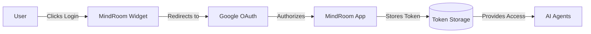

# Google OAuth Setup for MindRoom Administrators

This guide is for MindRoom administrators to set up Google OAuth **once** for all users.

## Overview

MindRoom uses a centralized OAuth approach where:
- **Administrators** set up ONE Google Cloud project
- **Users** just click "Login with Google" - no setup required
- **MindRoom** handles all the OAuth complexity

## One-Time Setup (5 minutes)

### Step 1: Create Google Cloud Project

1. Go to [Google Cloud Console](https://console.cloud.google.com/)
2. Click "Select a project" → "New Project"
3. Name it "MindRoom Integration"
4. Click "Create"

### Step 2: Enable APIs

1. In your new project, go to "APIs & Services" → "Library"
2. Search and enable these APIs:
   - Gmail API
   - Google Calendar API
   - Google Drive API
   - Google People API

### Step 3: Configure OAuth Consent Screen

1. Go to "APIs & Services" → "OAuth consent screen"
2. Choose "External" (so any Google user can use it)
3. Fill in:
   - App name: "MindRoom"
   - User support email: (your email)
   - Developer contact: (your email)
4. Click "Save and Continue"
5. Add scopes:
   - Click "Add or Remove Scopes"
   - Add these scopes:
     - `https://www.googleapis.com/auth/gmail.modify`
     - `https://www.googleapis.com/auth/calendar`
     - `https://www.googleapis.com/auth/drive.file`
     - `openid`
     - `email`
     - `profile`
6. Save and Continue
7. Add test users (optional during development)
8. Review and go back to dashboard

### Step 4: Create OAuth Credentials

1. Go to "APIs & Services" → "Credentials"
2. Click "Create Credentials" → "OAuth client ID"
3. Application type: "Web application"
4. Name: "MindRoom Web Client"
5. Add Authorized JavaScript origins:
   - `http://localhost:5173` (frontend dev)
   - `http://localhost:8000` (backend)
   - Your production URLs later
6. Add Authorized redirect URIs:
   - `http://localhost:8000/api/auth/google/callback`
   - Your production callback URL later
7. Click "Create"
8. **SAVE THE CLIENT ID AND SECRET**

### Step 5: Configure MindRoom

#### Option A: Environment Variables (Recommended)
Add to your `.env` file:
```bash
GOOGLE_CLIENT_ID=your-client-id.apps.googleusercontent.com
GOOGLE_CLIENT_SECRET=your-client-secret
```

#### Option B: Update Code (For Production)
Update the credentials in `widget/backend/src/api/google_auth.py`:
```python
MINDROOM_OAUTH_CONFIG = {
    "web": {
        "client_id": "your-client-id.apps.googleusercontent.com",
        "client_secret": "your-client-secret",
        # ... rest stays the same
    }
}
```

### Step 6: Test It

1. Start the backend: `cd widget/backend && uvicorn src.main:app --reload`
2. Start the frontend: `cd widget/frontend && pnpm run dev`
3. Go to http://localhost:5173
4. Click "Login with Google"
5. It should work without users needing any setup!

## For Production

### Publishing Your App

To remove the "unverified app" warning:

1. Go to "OAuth consent screen"
2. Click "Publish App"
3. Google may require verification if you're accessing sensitive scopes
4. Follow their verification process

### Security Best Practices

1. **Never commit credentials to git**
2. Use environment variables or secret management
3. Implement rate limiting
4. Log OAuth events for security monitoring
5. Regularly rotate client secrets
6. Use HTTPS in production

## How It Works



## Troubleshooting

### "This app isn't verified"
- Normal during development
- Click "Advanced" → "Go to MindRoom (unsafe)" to proceed
- Will disappear after publishing the app

### "Access blocked: Authorization error"
- Check that all redirect URIs match exactly
- Ensure JavaScript origins are correct
- Verify the OAuth consent screen is configured

### Users see "Setup Required"
- The admin hasn't configured the OAuth credentials yet
- Follow this guide to set them up

## Benefits of This Approach

✅ **Users**: Zero setup - just click and authorize
✅ **Security**: Tokens stored securely by MindRoom
✅ **Maintenance**: One OAuth app to maintain
✅ **Scalability**: Works for unlimited users
✅ **Simplicity**: No technical knowledge required from users
