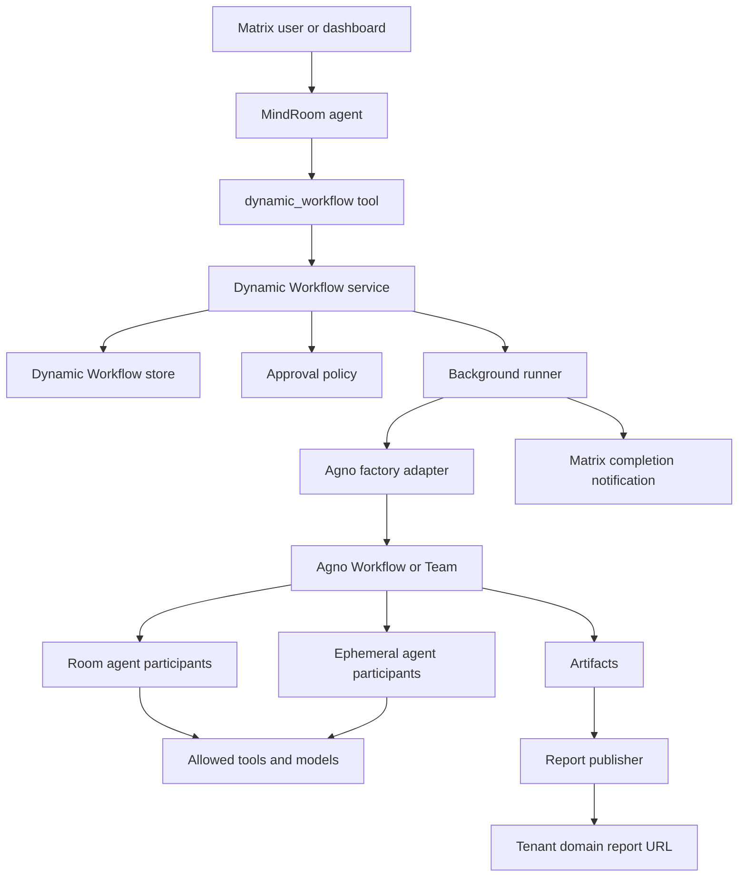

# Dynamic Workflows Design

## Summary

MindRoom should add Dynamic Workflows.
A Dynamic Workflow is a versioned, reusable workflow that agents can create, update, and run.
The first concrete use case should be deep research with HTML report publishing, but the design should support many workflow types.
Examples include due diligence, weekly briefings, PR review reports, incident reviews, migration plans, documentation audits, and recurring market reports.

The core primitive is a MindRoom Dynamic Workflow.
A Dynamic Workflow can use existing room agents and can create isolated ephemeral agents for one run.
The first implementation executes a run inside the tool call and persists artifacts such as Markdown, JSON, files, or hosted HTML reports.
Background jobs, progress events, and cancellation should be added after the runner lifecycle is managed by MindRoom.

Agno factories should be used as the orchestration implementation where they fit.
Agno `AgentFactory`, `TeamFactory`, and `WorkflowFactory` can build fresh components per request from caller identity and input.
MindRoom should not expose raw AgentOS directly in the first release.
MindRoom should own auth, tenant isolation, Matrix notifications, report URLs, storage, approval policy, and user-facing API.

This design deliberately mirrors the useful parts of Claude Code dynamic workflows.
The plan lives in a script or declarative spec, not inside the main agent context.
Intermediate results stay in workflow state, not in the Matrix conversation context.
The first implementation keeps workflow execution on the managed agent tool path.
The user can inspect, approve, save, rerun, update, and roll back workflow definitions.

## Goals

- Let agents assemble repeatable workflows instead of manually coordinating every step in one chat turn.
- Let workflows reuse durable room agents when their existing expertise, public role, model policy, or identity matter.
- Let workflows create ephemeral agents for temporary roles such as planner, critic, source reader, analyst, or report writer.
- Keep ephemeral agents isolated from durable agent memory, credentials, Matrix identity, and tools unless policy explicitly grants access.
- Store Dynamic Workflows and revisions on disk so self-hosted users can inspect, back up, copy, and audit them.
- Persist Dynamic Workflow runs with artifacts, report URLs, and final outputs.
- Make permission expansion explicit and approval-gated.
- Enable deep research workflows without hard-coding deep research as a one-off feature.

## Non-Goals

- Do not let agents create arbitrary executable Python or JavaScript workflow code in the first release.
- Do not expose raw AgentOS HTTP endpoints to users or agents in the first release.
- Do not create Matrix accounts for ephemeral workflow agents.
- Do not mutate `config.yaml` when creating ephemeral agents.
- Do not let a workflow coordinator call shell, filesystem, browser, or network tools directly.
- Do not make database records the source of truth for workflow specs in the first release.

## User Perspective

### Creating a Dynamic Workflow From Chat

A user can ask a MindRoom agent to create a workflow.
For example, the user can say: "Create a recurring competitor research workflow that uses our research agent, adds a source critic, and publishes a report."

The agent calls `create_workflow`.
MindRoom validates the workflow spec and returns a draft with a summary of participants, tools, models, data access, cost limits, and output artifacts.
If the workflow asks for new capabilities, MindRoom sends an approval card before it can become active.

The user sees a clear summary instead of raw YAML.
The user can approve once, approve always for that workflow in that scope, deny, or ask the agent to revise.

### Running a Dynamic Workflow

The user can ask: "Run the competitor research workflow for Anthropic, OpenAI, and Google."
The agent calls `run_workflow`.
MindRoom executes the active revision, stores a run record, and returns the final run payload with a private report URL when configured.
The run is pinned to the active revision it started with.

If the workflow produced an HTML report, the message includes a URL on the same hosted MindRoom domain.
If the report is private, the URL requires normal MindRoom authentication.
If the report is public, the URL uses an unguessable slug and records who published it.

### Watching Progress

The user can open a Dynamic Workflow run view in the dashboard.
The run view shows phases, active agents, elapsed time, token and cost estimates when available, and recent step outputs.
The first implementation stores completed or failed run state and artifacts.
Cancellation and live progress should be added with the background runner.
Future versions can pause and resume runs if the backing runner supports it.

### Updating a Dynamic Workflow

The user or agent can update a Dynamic Workflow after a bad run.
For example, the agent can call `update_workflow` to add source confidence scoring or change the report outline.
MindRoom creates a new revision instead of mutating the active revision in place.

If the update does not expand permissions, MindRoom can auto-publish the new revision under policy.
If the update adds a model, tool, data source, public visibility, larger budget, or new room agent, MindRoom requires approval.
The user can inspect the diff and roll back to an older revision.

### Dashboard Experience

The dashboard should have a Dynamic Workflow library.
The library lists agent-scoped, room-scoped, and tenant-scoped workflows.
Each workflow page shows active revision, draft revisions, run history, artifacts, permissions, and rollback options.
Admins can enable or disable Dynamic Workflow creation per agent, room, or tenant.

## Core Concepts

### Dynamic Workflow

A Dynamic Workflow is a saved definition for building and running an agent, team, or workflow at request time.
It has a stable ID, a scope, metadata, an active revision, and immutable revision files.
It can be declarative or trusted-code-backed.

### Workflow Revision

A revision is an immutable workflow spec.
Every run is pinned to one revision.
Updating a Dynamic Workflow creates a new revision.
Publishing a revision only changes the active revision pointer.

### Workflow Run

A run is one execution of one workflow revision with one input payload.
It records status, participant outputs, artifacts, and final result.
It may run in the primary runtime, a sandbox-runner sidecar, or a dedicated worker.

### Room Agent Participant

A room agent participant reuses an existing MindRoom agent that is available in the current room.
The current implementation reuses the durable agent's public role, configured model policy, and Matrix-facing identity context.
It does not inherit durable memory, tools, skills, credentials, or knowledge until an explicit approval policy grants those capabilities.
It should run as an internal participant in the workflow instead of posting every intermediate step to Matrix.
It should be constrained to the current room and thread context.

Future memory or tool grants should be treated as permission expansion.
Dynamic Workflows may request `read_only` or `normal` memory behavior only after that approval policy exists.

### Ephemeral Agent Participant

An ephemeral agent participant exists only for one workflow run.
It has no Matrix account.
It has no persistent memory by default.
It does not inherit creator credentials, creator tools, or durable agent tools.
It can use only allowlisted models in the current implementation.
Future tool grants should be treated as permission expansion and require an explicit Dynamic Workflow approval policy.

### Workflow Coordinator

The coordinator is the workflow spec or script.
The coordinator decides which steps run next and how intermediate outputs flow between steps.
The coordinator should not directly use shell, filesystem, browser, Matrix, or network tools.
Only agents inside the workflow should call tools after the workflow has explicit tool grants.

This mirrors Claude Code dynamic workflows, where the workflow script coordinates agents and agents execute tools.

## Architecture



## MindRoom Tool Surface

The first user-facing capability should be a tool named `dynamic_workflow`.
This matches the product concept and hides Agno implementation details.

```python
create_workflow(spec: dict, scope: str = "agent", reason: str | None = None) -> dict
validate_workflow(spec: dict) -> dict
update_workflow(workflow_id: str, patch: dict, reason: str, scope: str = "agent") -> dict
run_workflow(workflow_id: str, input: dict, scope: str = "agent") -> dict
get_workflow_run(workflow_id: str, run_id: str, scope: str = "agent") -> dict
list_workflows(scope: str = "agent") -> dict
list_workflow_revisions(workflow_id: str, scope: str = "agent") -> dict
```

The tool should be configurable per agent.
Admins should be able to restrict which actions an agent can call.
For example, a normal assistant might be allowed to run workflows but not create or publish them.

## Declarative Workflow Spec

The first release should use declarative YAML or JSON specs.
Declarative specs are inspectable, diffable, policy-checkable, and safe for agents to write.
The spec can compile to an Agno `WorkflowFactory`, `TeamFactory`, or `AgentFactory`.

Example:

```yaml
schema_version: 1
id: competitor-research-report
name: Competitor Research Report
description: Create a cited HTML report about competitors.
kind: workflow
inputs:
  type: object
  required:
    - topic
  properties:
    topic:
      type: string
    report_visibility:
      type: string
      enum:
        - private
        - public
      default: private
participants:
  - id: existing_researcher
    kind: room_agent
    agent: researcher
  - id: critic
    kind: ephemeral_agent
    name: Source Critic
    model: claude-sonnet-4-6
    tools: []
  - id: writer
    kind: ephemeral_agent
    name: Report Writer
    model: claude-sonnet-4-6
    tools: []
workflow:
  - id: plan
    type: agent_step
    participant: existing_researcher
    prompt: Create a research plan for {input.topic}.
  - id: gather
    type: transform_step
    template: "Source notes for {input.topic}: use the research plan from {steps.plan}."
  - id: check
    type: agent_step
    participant: critic
    prompt: "Cross-check the plan and source notes. Plan: {steps.plan}\nNotes: {steps.gather}"
  - id: write
    type: agent_step
    participant: writer
    prompt: "Write a cited report in Markdown from these notes: {steps.gather}\nCritique: {steps.check}"
outputs:
  - id: report_markdown
    type: markdown
    from_step: write
  - id: report_html
    type: html_report
    from_step: write
permissions:
  max_runtime_seconds: 1800
  max_concurrent_agents: 1
  max_total_agents: 3
  models:
    - claude-haiku-4-5
    - claude-sonnet-4-6
  tools: []
  data:
    matrix_history: none
    attachments: none
    knowledge_bases: []
```

## Trusted Code Workflows

Trusted code workflows can come later.
They can be installed through plugins or bundled modules.
They should be admin-controlled and should not be authored directly by agents in the first release.

A trusted code workflow may wrap an Agno `WorkflowFactory` module directly.
This is useful for complex branching, loops, retries, and custom quality checks that are awkward in declarative YAML.
Deep research can start declarative, but a mature version may become a trusted code workflow if the quality loop becomes complex.

## Agent and Model Policy

Dynamic Workflow execution must use a permission intersection.
The creator does not grant power by asking for it.

Effective permissions should be:

```text
requested workflow permissions
intersect creator agent permissions
intersect current room policy
intersect authenticated user policy
intersect tenant policy
intersect global Dynamic Workflow allowlist
```

Models should be selected from explicit allowlists.
The allowlist can come from `config.yaml`, tenant settings, and tool configuration.
Ephemeral agents may request a model by ID, but the runner must reject or rewrite it if not allowed.

The model allowlist should prefer the repository's current frontier model table when users do not specify a model.
If model names conflict with the table or appear stale, provider docs should be checked before rejecting them.

## Data Access Policy

Dynamic Workflows should have explicit data access fields.
A workflow can request current thread history, current room history, specific attachments, selected knowledge bases, web search, or private tools.
The policy engine should validate every request.

Data access defaults should be narrow.
Default Matrix history should be current thread only.
Default attachments should be current thread only.
Default knowledge access should be none unless selected.
Default report visibility should be private.

Public report publishing should always be visible in the approval summary.

## Storage Layout

Dynamic Workflow specs should live under `MINDROOM_STORAGE_PATH`.
This keeps self-hosted state portable and inspectable.

```text
mindroom_data/
  dynamic_workflows/
    agent/
      <agent_name>/
        <workflow_id>/
          workflow.yaml
          revisions/
            000001.yaml
            000002.yaml
          runs/
            run_<id>.json
          artifacts/
            run_<id>/
              report.md
              report.html
              sources.json
    room/
      <room_id_hash>/
        <workflow_id>/
          workflow.yaml
          revisions/
          runs/
          artifacts/
    tenant/
      <workflow_id>/
        workflow.yaml
        revisions/
        runs/
        artifacts/
```

`workflow.yaml` should be a small mutable pointer file.
Revision files should be immutable.
Run records should be append-only except for status updates.
Artifact files should be immutable after publication unless a new artifact revision is explicitly created.

Example `workflow.yaml`:

```yaml
id: competitor-research-report
scope: room
active_revision: "000004"
created_by: assistant
created_at: "2026-06-07T12:00:00Z"
updated_at: "2026-06-07T13:22:00Z"
archived: false
```

Writes should be atomic.
The implementation should write temporary files, validate them, then rename them into place.
The implementation should use per-workflow locks to avoid concurrent update races.

## Report Publishing

The report publisher should be a MindRoom service, not an Agno or AgentOS public endpoint.
It should serve private and public artifacts from the tenant's existing MindRoom domain.

Example URLs:

```text
https://acme.mindroom.chat/reports/private/<scope>/<owner_key>/<workflow_id>/<run_id>
https://acme.mindroom.chat/reports/public/<unguessable_slug>
```

Private reports should require normal dashboard authentication.
Public reports should use unguessable slugs and should record publishing metadata.
Public reports should be revocable.
Report HTML should be sanitized.
Report pages need a tailored Content Security Policy because HTML reports may use inline styles and images.

## Run Lifecycle

1. The agent calls `run_workflow`.
2. MindRoom resolves the workflow and active revision.
3. MindRoom validates input against the workflow input schema.
4. MindRoom computes effective permissions.
5. MindRoom creates a run record.
6. MindRoom executes the run on the managed tool path.
7. The runner builds Agno components from the workflow revision and request context.
8. The workflow runs steps and records step outputs.
9. The runner writes artifacts.
10. The report publisher creates private or public URLs.
11. MindRoom returns the final run payload to the caller.
12. The dashboard and tool can read the run record.

Running workflows should stay pinned to the revision they started with.
Updating the active workflow should not change an in-flight run.

## Approval Rules

Dynamic Workflow creation can auto-approve only for low-risk agent-scoped workflows.
Room-scoped and tenant-scoped workflows should require approval before activation unless admin policy says otherwise.

Permission expansion should require approval.
Examples include adding a tool, adding a model, adding a room agent, increasing runtime caps, increasing concurrency caps, requesting broader Matrix history, requesting attachments, requesting knowledge bases, or changing default visibility to public.

Permission reduction can auto-publish under policy.
Prompt-only edits can auto-publish under policy if they do not change data access or capabilities.

Approval cards should show:

- Workflow name and scope.
- Participant list.
- Existing room agents used.
- Ephemeral agents created.
- Models requested.
- Tools requested.
- Data sources requested.
- Runtime and concurrency caps.
- Output artifacts.
- Visibility policy.
- Diff from prior revision when updating.

## Agno Integration

MindRoom should upgrade Agno to at least the first version with factories.
The current candidate from PyPI is Agno 2.6.9.
The minimum feature version is Agno 2.6.0.

The initial adapter path should keep MindRoom policy and storage outside Agno internals.
The adapter should compile declarative workflow specs into Agno `Workflow`, `Team`, or `Agent` objects.
When useful, it can wrap those builders with Agno `WorkflowFactory`, `TeamFactory`, or `AgentFactory`.
The adapter should construct request context from MindRoom identity, not from untrusted model-provided input.

If AgentOS is needed for run persistence or streaming, it should remain internal.
MindRoom should call it through a service token or in-process adapter.
Public routes should remain MindRoom routes.

## Claude Dynamic Workflow Parallels

Claude Code dynamic workflows provide a useful product model.
Their documentation says workflows are scripts that orchestrate many subagents in the background.
The script holds loops, branching, and intermediate results.
The conversation receives the final answer instead of every intermediate result.
The user can inspect, approve, save, rerun, and manage workflow runs.
The runtime caps concurrency and total agents.
The script coordinates agents, while agents may use tools after explicit grants.

MindRoom should adopt those constraints.
The workflow coordinator should coordinate, not execute arbitrary tools.
Future managed runs should be inspectable and backgrounded.
Saved workflows should become reusable commands or tool targets.
Costs and limits should be visible before and during a run.

## Deep Research as First Dynamic Workflow

Deep research should be the first bundled Dynamic Workflow.
It should produce Markdown and HTML report artifacts.
It should default to private reports.
It should use web search and website reading tools when allowed.
It should support optional use of room agents.
It should create ephemeral source readers, critics, and report writers.
It should cross-check claims and filter unsupported claims before report writing.

This gives users the desired hosted report workflow without building a separate Odysseus clone.
The same Dynamic Workflow framework can then support other repeatable workflows.

## Phased Rollout

### Phase 1: Storage, Validation, and Basic Runs

- Upgrade Agno to a factory-capable version.
- Add Dynamic Workflow storage under `MINDROOM_STORAGE_PATH`.
- Add declarative workflow spec schema.
- Add `create_workflow`, `validate_workflow`, `update_workflow`, `run_workflow`, `get_workflow_run`, `list_workflows`, and `list_workflow_revisions`.
- Support ephemeral agents with a model allowlist.
- Support room agent participants without durable memory, tools, skills, credentials, or knowledge.
- Reject Matrix context, attachment, knowledge, and tool grants until they are wired into execution.
- Store run records and artifacts.
- Add private report serving.
- Implement deep research as a bundled declarative Dynamic Workflow.

### Phase 2: Grants, Publishing, and Dashboard

- Add publish, rollback, and archive actions.
- Add approval cards for workflow activation and permission expansion.
- Add full room-agent memory, tool, skill, and knowledge grants.
- Add dashboard Dynamic Workflow library and run detail page.
- Add public report links with revocation.
- Add run cancellation.
- Add token and cost summaries where provider metadata supports it.

### Phase 3: Worker-Backed Execution and Advanced Control

- Run long workflow jobs through sandbox-runner or dedicated Kubernetes workers.
- Add pause and resume where practical.
- Add run queues and per-tenant concurrency limits.
- Add scheduled workflow runs.
- Add trusted code-backed workflow modules through plugins.
- Add richer progress UI with per-phase and per-agent detail.

### Phase 4: Agent-Authored Workflow Evolution

- Let agents propose workflow improvements from run results.
- Add policy-based auto-publish for safe prompt-only edits.
- Add quality scoring and self-review hooks.
- Add template workflows for common domains.
- Consider script-backed workflows for trusted users only.

## Testing Strategy

Unit tests should cover spec validation, permission intersection, storage paths, revision immutability, atomic writes, and patch classification.
API tests should cover create, update, publish, run, list, and artifact serving.
Future background execution tests should cover cancel.
Security tests should cover cross-room access denial, unauthorized model denial, unauthorized tool denial, public report revocation, and invalid path traversal.
Integration tests should run a tiny Dynamic Workflow with two ephemeral agents and one artifact.
Live tests should run the deep research workflow with a small query and confirm the Matrix completion link works.

Agno upgrade tests should cover existing MindRoom agent runs, teams, tools, skills, memory, and OpenAI-compatible API behavior.
This is needed because the Agno upgrade touches a shared runtime dependency.

## Expected First User Experience

The first version should feel like this:

1. A user asks for a deep research report.
2. The agent creates or reuses a Dynamic Workflow and calls the Dynamic Workflow tool.
3. MindRoom creates a run, executes the active revision, and returns a private report URL when report artifacts exist.
4. The final Matrix message links to the report.
5. Future versions should move long runs to managed background jobs with progress and cancellation.
6. The user can ask the agent to improve and save the workflow.
7. The workflow revision history records what changed and why.

This should make MindRoom feel like it can build and reuse its own workflow systems without turning every workflow into a permanent Matrix bot.

## References

- Agno Dynamic Agents: https://docs.agno.com/agent-os/factories/overview
- Agno WorkflowFactory: https://docs.agno.com/agent-os/factories/workflow-factory
- Agno Factories Reference: https://docs.agno.com/reference/agent-os/factories
- Claude Code Dynamic Workflows: https://code.claude.com/docs/en/workflows
- Odysseus Deep Research reference: https://github.com/pewdiepie-archdaemon/odysseus
